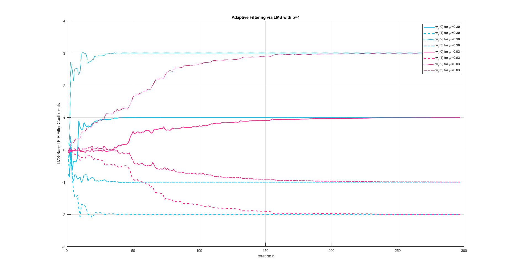
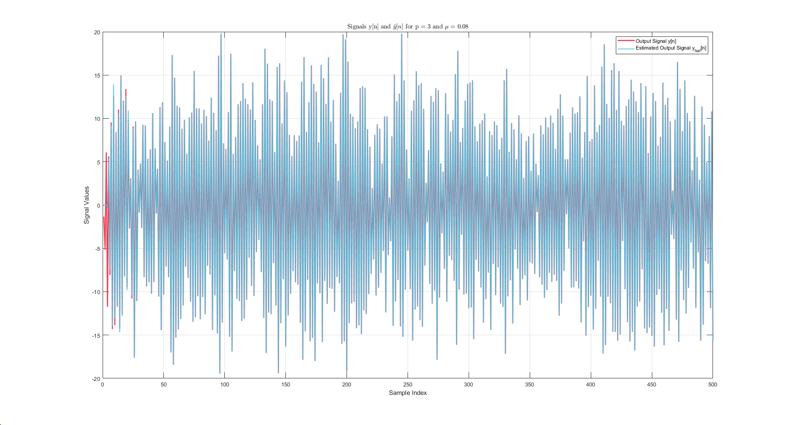

# Stochastic Signal Processing Projects 2023-2024

This repository contains MATLAB scripts for implementing and analyzing adaptive filtering using the Least Mean Squares (LMS) algorithm. These projects focus on understanding the behavior of LMS-based filters in different configurations, visualizing convergence, and comparing performance metrics.

---

## **Contents**
### **Project 2 - Question 2.2**
#### Description:
This script explores the LMS algorithm for adaptive filtering with varying filter orders (`p = 2, 3, 4`) and step sizes (`μ`). It provides insights into how these parameters affect:
- Filter coefficient convergence.
- Mean Squared Error (MSE) behavior over iterations.

#### Features:
- Dynamically calculates an upper bound for `μ` based on input signal properties.
- Visualizes:
  - Adaptive filter coefficients for each configuration.
  - MSE convergence in dB across iterations.
- Offers comparative analysis between different filter orders and step sizes.

#### Visual Outputs:
- Signals `y[n]` and `u[n]`.
- Adaptive filter coefficients.
- MSE convergence for multiple configurations.

---

### **Project 3 - Question 3.2**
#### Description:
This script implements the LMS algorithm with a fixed filter order (`p = 3`) and step size (`μ = 0.08`). It focuses on analyzing the estimation quality of the filter and its error metrics.

#### Features:
- Computes the estimated output signal `ŷ[n]` and compares it to the actual output signal `y[n]`.
- Visualizes:
  - Adaptive filter coefficient convergence.
  - MSE behavior in dB.
  - Original output signal `y[n]` and its estimate `ŷ[n]`.

#### Visual Outputs:
- Signals `x[n]` and `y[n]`.
- Adaptive filter coefficients.
- Estimated output signal and comparison with the original signal.
- MSE convergence for the fixed configuration.

---

## **Key Differences**
| Feature                         | Project 2 - Question 2.2               | Project 3 - Question 3.2          |
|---------------------------------|---------------------------------------|-----------------------------------|
| **Input/Output Signals**        | `u[n]` (input), `y[n]` (output)       | `x[n]` (input), `y[n]` (output)  |
| **Filter Orders**               | `p = 2, 3, 4`                        | `p = 3`                          |
| **Step Sizes**                  | Multiple `μ` values per order         | Single `μ = 0.08`                |
| **Focus**                       | Comparative analysis of configurations| Detailed analysis of a fixed setup |
| **Visual Outputs**              | Coefficients, MSE for multiple setups | Coefficients, estimated signal, MSE |

---

## Requirements  
- MATLAB R2020a or later.  
- Signal Processing Toolbox for certain functions like `periodogram`.  

---

## **Usage**
1. Load the required `.mat` file (`2.mat`).
2. Run the MATLAB script for the corresponding project (`Project_2_Question_2_2.m` or `Project_3_Question_3_2.m`).
3. Explore the visualizations and analyze the results.

---

## License  
This project is licensed under the MIT License. See the `LICENSE` file for details.  

---

## **Acknowledgments**
These projects were developed as part of the *Stochastic Signal Processing* course (2023-2024) to illustrate the practical implementation of LMS adaptive filtering.
